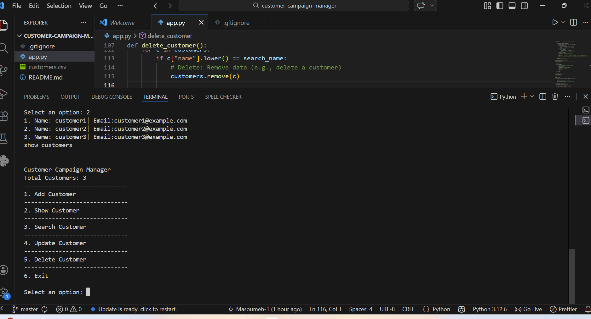

# Braze Customer Data Preparation Tool (Python)

A simple command-line Python application for managing customer data.

## Features

- Add, view, search, update, and delete customers (CRUD)
- Input validation and data cleaning
- Prevent duplicate emails
- Save and load data using CSV files

## Technologies

- Python
- CSV file handling

## Use Case

This project simulates preparing clean customer data for marketing platforms like Braze.

## Demo

